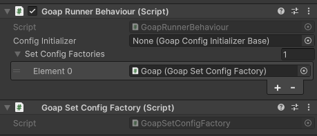
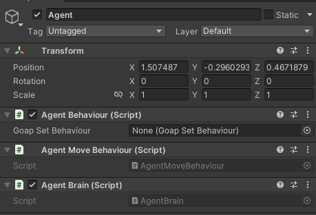

# Getting Started > Code

1. Create a new scene
2. Create a new GameObject called `Goap`, add the `GoapRunnerBehaviour` to it.


3. Create a class called `GoapSetConfigFactory` that extends `GoapSetConfigFactoryBase` and override the `Create` method.


```csharp
public class GoapSetConfigFactory : GoapSetFactoryBase
{
    public override IGoapSetConfig Create()
    {
        var builder = new GoapSetBuilder("GettingStartedSet");
        
        // Goals
        builder.AddGoal<WanderGoal>()
            .AddCondition("IsWandering", Comparison.GreaterThanOrEqual, 1);

        // Actions
        builder.AddAction<WanderAction>()
            .SetTarget("WanderTarget")
            .AddEffect("IsWandering", true)
            .SetBaseCost(1)
            .SetInRange(0.3f);

        // Target Sensors
        builder.AddTargetSensor<WanderTargetSensor>()
            .SetTarget("WanderTarget");

        // World Sensors
        // This example doesn't have any world sensors. Look in the examples for more information on how to use them.

        return builder.Build();
    }
}
```


4. Add the `GoapSetConfigFactory` to the `Goap` GameObject. Make sure to add the `GoapSetConfigFactory` to the `GoapRunnerBehaviour`'s factories property.



5. Create a script called `GoapSetBinder`. This script will assign a `GoapSet` to the `Agent`.


```csharp
public class GoapSetBinder : MonoBehaviour {
    public void Start() {
        var runner = FindObjectOfType<GoapRunnerBehaviour>();
        var agent = GetComponent<AgentBehaviour>();
        agent.GoapSet = runner.GetSet("GettingStartedSet");
    }
}
```


5. Create a sphere `GameObject` called `Agent`. Add the `AgentBehaviour`, `AgentMoveBehaviour`, `AgentBrain` and `GoapSetBinder` to the `GameObject`.



6. Run the scene. The agent should move around randomly.